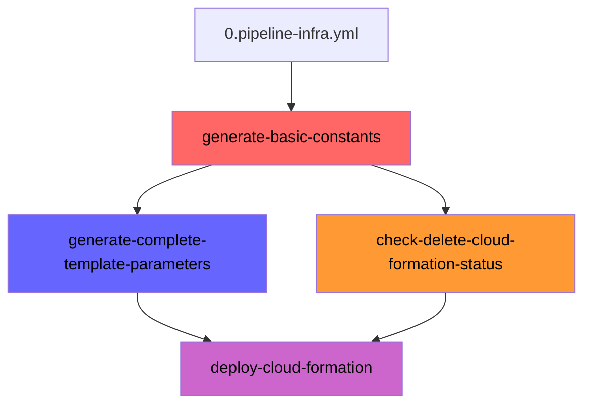
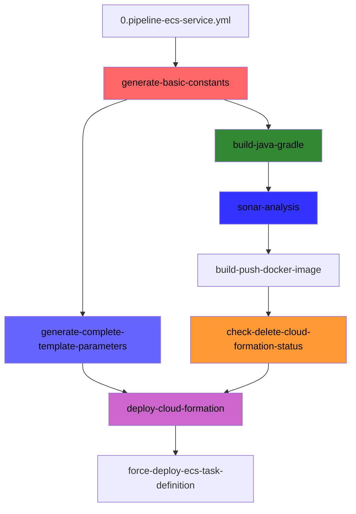
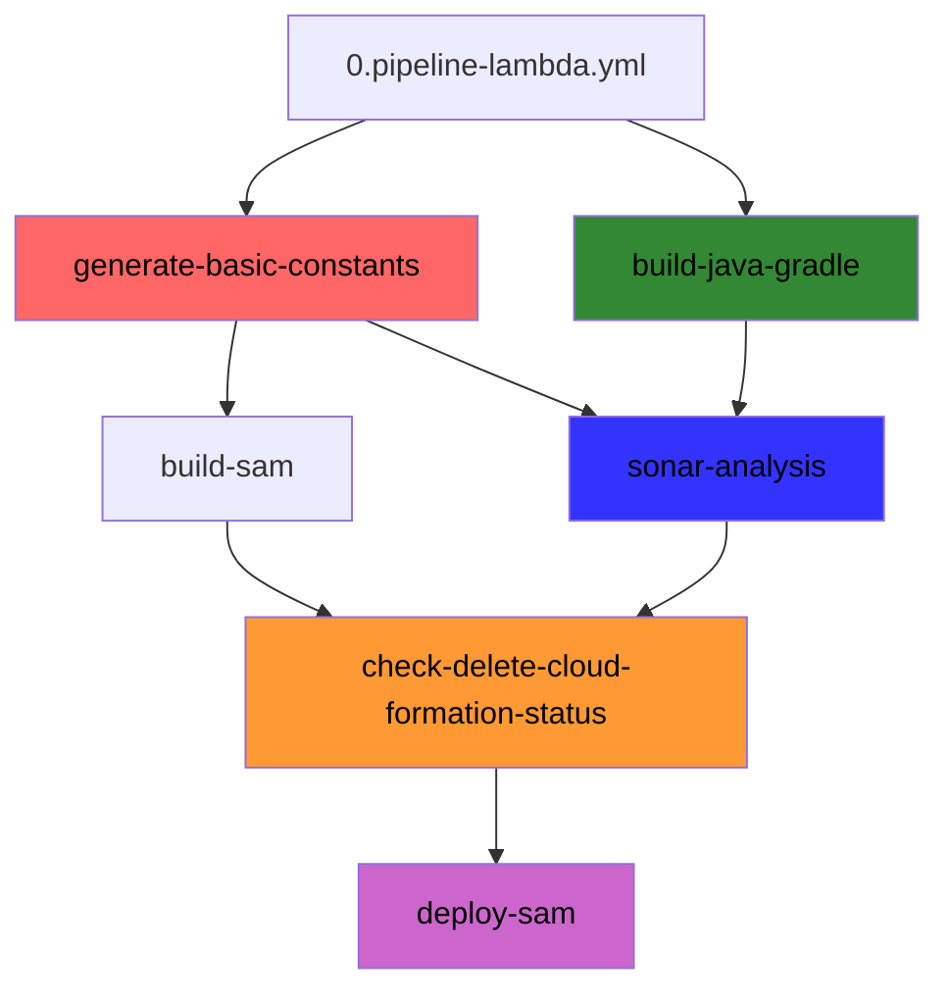
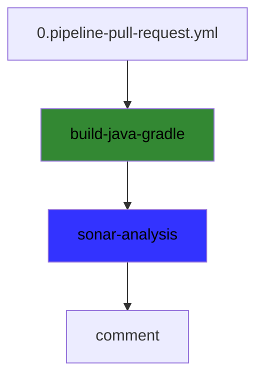
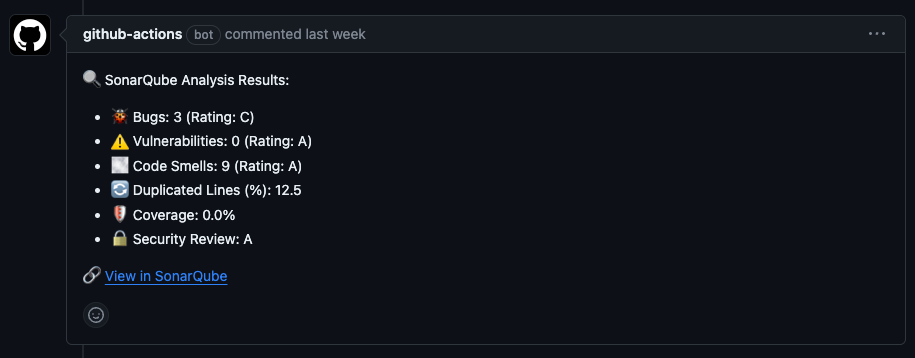

#  dsc-shared-pipelines

Repositório de Workflows (Pipelines/Esteiras) de CI/CD que são usados no projeto [dscommerce](https://github.com/search?q=topic%3Adscommerce+org%3Adevsuperior&type=Repositories).

Esses Workflows utilizam do GitHub Actions como meio para executar as integrações necessárias para o deploy de aplicações e infraestrutura na AWS.

Dentro do GitHub Workflows existe o recurso chamado `Reusable Workflows` ao qual permite encadear e reaproveitar workflows. É possível enviar e receber parâmetros semelhante a uma função códificada em uma linguagem qualquer.

No projeto [dscommerce](https://github.com/search?q=topic%3Adscommerce+org%3Adevsuperior&type=Repositories) convencionamos que a primeira etapa do Workflow se chama **Pipeline**. Essa primeira etapa é responsável por iniciar um fluxo com um objetivo claro, deploy de infraestrutura, deploy de lambda, dentre outros. 

Em um **Pipeline** há uma coordenação/orquestração de Workflows que cumprem o objetivo do pipeline.

Para representar os Workflows foram feitos diagramas que podem ser conferidos abaixo, **um Workflow que foi reutilizado pode ser facilmente identificado através de seu nome e cor**, por exemplo, se o Workflow de integração com o Sonar se chama `sonar-analysis` e ele tiver sido reaproveitado em outro Pipeline, ele terá esse mesmo nome em todos os pipes e a mesma cor, por exemplo, azul.

| :exclamation:  Nos repositórios de projeto é mandatório invocar apenas os Workflows do tipo Pipeline, que são identificados pelo prefixo do yml: `0.pipeline`.   |
|------------------------------------------------------------------------------------------------------------------------------------------------------------------|

Abaixo a especificação de cada um dos Pipelines.

## Pipeline de Deploy de Infras no Geral

O objetivo desse pipeline é realizar o deploy de qualquer infra via AWS CloudFormation que não necessite de um "step especial" de build a não ser provisionar os recursos declarados no `template.yml` do repositório chamador.

Esse pipeline também precisa do `template-parameters.json` como argumento e injeta nele duas propriedades:
- RepositoryName: nome do repositório chamador.
- EnvironmentName: nome do ambiente de acordo com a branch do repositório chamador (develop: dev, release-candidate: stg, main: prd).

[Clique aqui para acessar o pipeline](./.github/workflows/0.pipeline-infra.yml).

## Pipeline de Deploy de Serviços ECS 

O objetivo desse pipeline é realizar o deploy de microservices, ou qualquer outro tipo de serviço orquestrado pelo AWS Elastic Container Service via AWS CloudFormation.

**Os serviços que utilizam essa pipeline devem obrigatoriamente utilizar Java 17, Gradle e Docker.**

Esse pipeline faz o build com Java 17 e Gradle, submete o código para análise do Sonar, cria uma nova imagem Docker no AWS Elastic Container Registry, tenta realizar o deploy via AWS Cloudformation, mas caso não exista mudanças no `template.yml` força um novo deployment com a imagem latest versionada no AWS Elastic Container Registry. 

Esse pipeline também precisa do `template-parameters.json` como argumento e injeta nele duas propriedades:
- RepositoryName: nome do repositório chamador.
- EnvironmentName: nome do ambiente de acordo com a branch do repositório chamador (develop: dev, release-candidate: stg, main: prd).

[Clique aqui para acessar o pipeline](./.github/workflows/0.pipeline-ecs-service.yml).

## Pipeline de Deploy de Lambdas Java

O objetivo desse pipeline é realizar o deploy de microservices no formato AWS Lambda com tecnologia Java 17 ou GraalVM nativo via AWS SAM.

**Para AWS Lambda Convencional, os serviços que utilizam essa pipeline devem obrigatoriamente utilizar Java 17, Gradle.**

**Para AWS Lambda Imagem Nativa, os serviços que utilizam essa pipeline devem obrigatoriamente a imagem Docker oficial da AWS para Build com GraalVM.**

Esse pipeline utiliza o AWS SAM como template, semelhante ao AWS Cloudformation mas possui facilitadores para build e deploy. Antes de se integrar com esse pipeline certifique-se que o projeto está configurado corretamente com AWS SAM.

Esse pipeline faz o build com Java 17 e Gradle, submete o código para análise do Sonar, faz o build com AWS SAM, tenta realizar o deploy com AWS SAM, mas caso não exista mudanças no `template.yml` força um novo deployment do lambda.

Os lambdas ditos como "Convencionais" são habilitados automaticamente no SnapStart da AWS Lambda.

Todos os lambdas quando publicados recebem uma tag de invocação chamada "target" que aponta pra última versão.

Esse pipeline NÃO precisa do `template-parameters.json` como argumento ele injeta diretamente no `template.yml` duas propriedades:
- RepositoryName: nome do repositório chamador.
- EnvironmentName: nome do ambiente de acordo com a branch do repositório chamador (develop: dev, release-candidate: stg, main: prd).

[Clique aqui para acessar o pipeline](./.github/workflows/0.pipeline-lambda.yml).

## Pipeline de Verificação de Pull Request no Sonar

O objetivo desse pipeline é realizar a análise do projeto antes que o commit merge seja realizado (etapa de Pull Request) para uma das branchs de destino reservadas (develop, release-candidate, main).

Esse pipeline é aplicável apenas à microservices que sejam possíveis de construir usando Java 17 e Gradle.

Após abrir um "PR" para as branch reservadas o pipeline se inicia e como resultado é adicionado um novo comentário ao Pull Request semelhante a esse abaixo:

Baseado no resultado pode-se tomar a decisão de aprovar ou não o Pull Request.

[Clique aqui para acessar o pipeline](./.github/workflows/0.pipeline-pull-request.yml).
