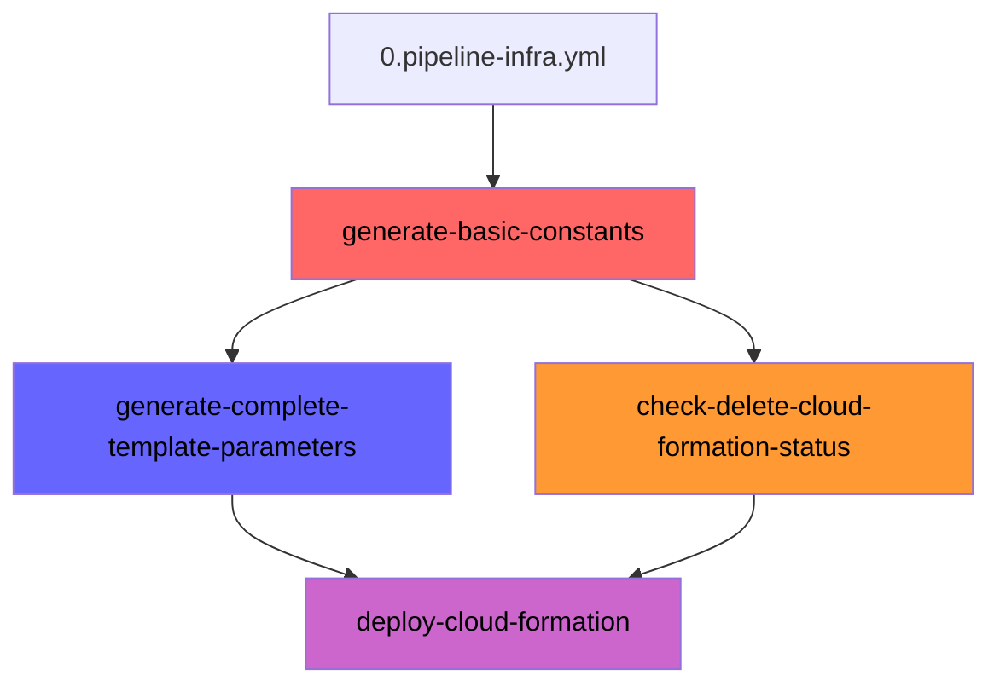
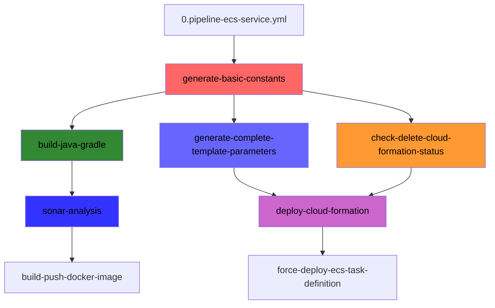
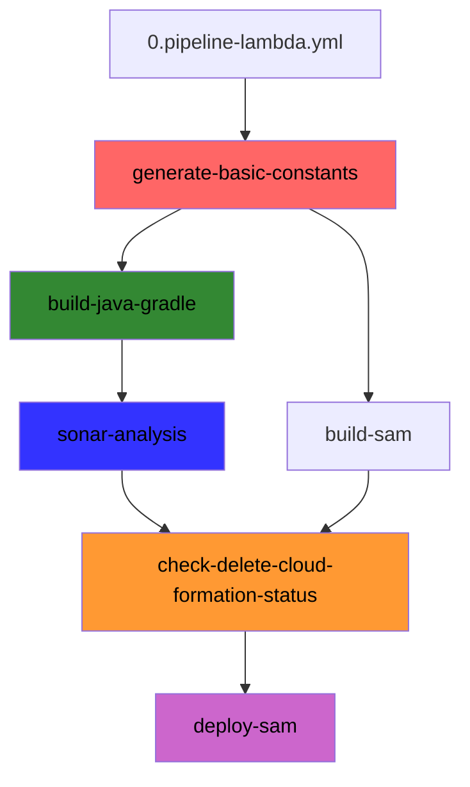
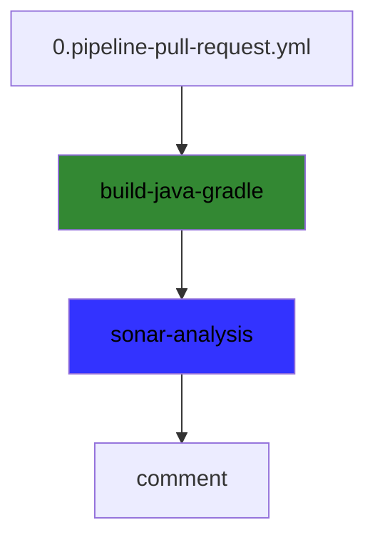

# dsc-shared-pipelines
Repositório de Workflows

## Template de Deploy de Infras no Geral

## Template de Deploy de Serviços ECS 

## Template de Deploy de Lambdas Java

## Template de Verificação de Pull Request no Sonar

